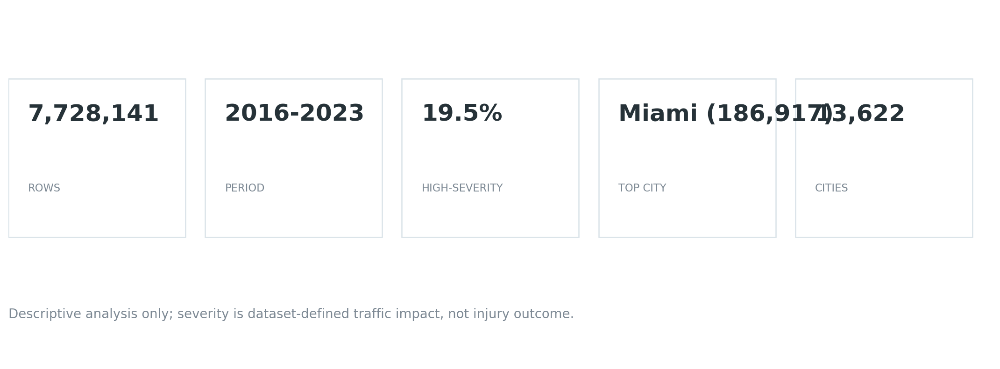
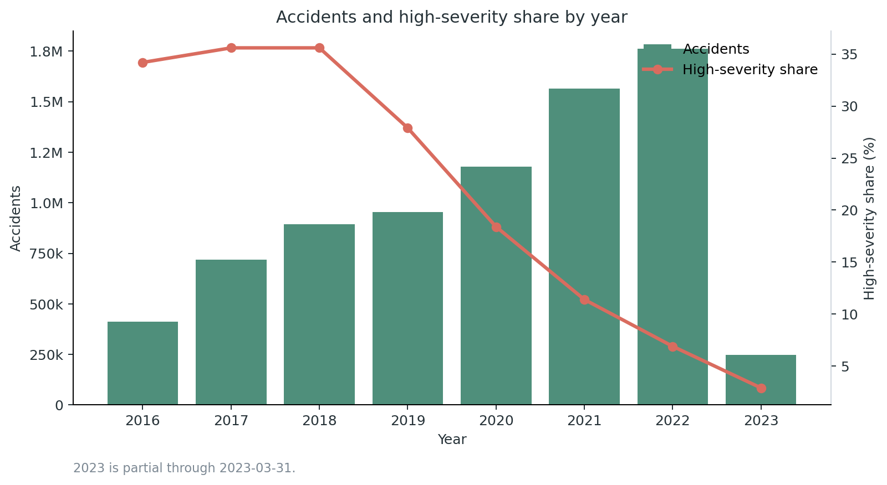
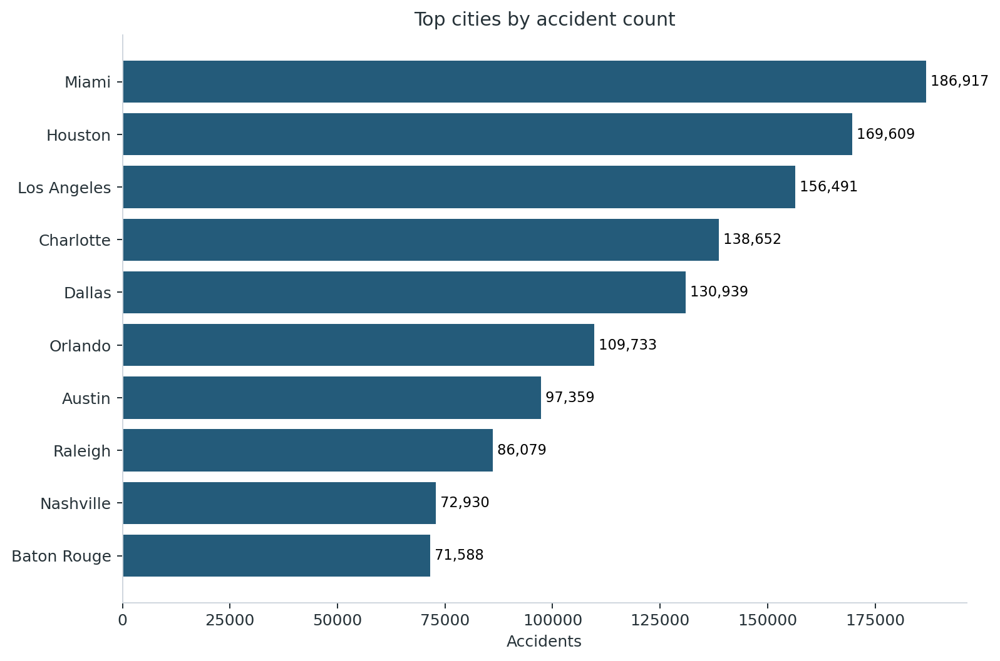
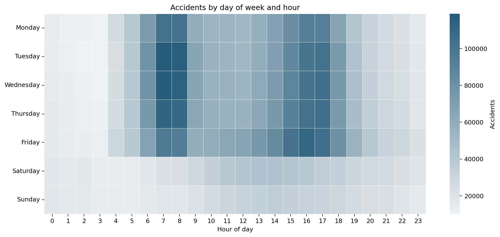
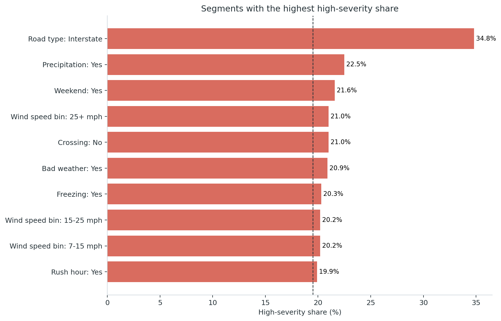
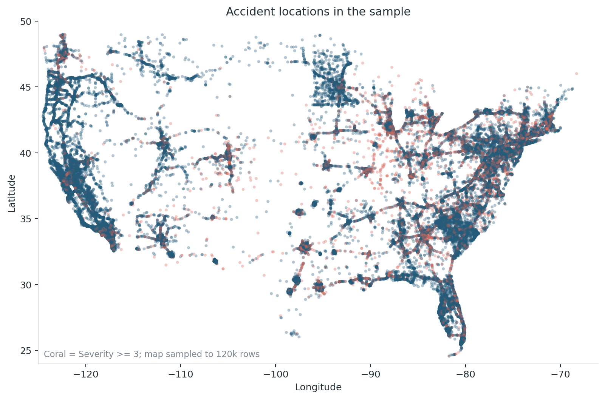

# US Road Accidents Analysis


A reproducible Python analysis project for exploring road accident patterns in the United States. The project loads the `US_Accidents_March23.csv` dataset, cleans core fields, engineers time/weather/road features, runs severity checks, and exports portfolio-ready charts, tables, and a dashboard.

The repository includes a small sample dataset for quick review, while the generated portfolio report below was built from the full local dataset.

## Portfolio Snapshot

Generated from the full dataset:

- 7,728,141 rows analyzed after cleaning.
- 2016-2023 period covered; the 2023 data is partial through 2023-03-31.
- 19.5% high-severity records, where high-severity means `Severity >= 3`.
- Top cities by accident count: Miami, Houston, Los Angeles, Charlotte, Dallas.
- Reproducible output: Markdown report, CSV tables, PNG figures, static HTML dashboard.



## Key Visuals











## What This Demonstrates

- Data loading and fallback logic for local full-data and bundled-sample workflows.
- Chunked ETL for a multi-gigabyte CSV file.
- Cleaning and validation of accident records, date fields, geographic fields, and severity values.
- Feature engineering for weekend, night, rush hour, precipitation, bad weather, visibility, freezing temperature, road type, crossing, and wind-speed bins.
- Exploratory analysis with yearly KPIs, city rankings, hourly patterns, severity segmentation, geographic overview, and data quality checks.
- Reproducible reporting through `reports/portfolio_report.md`, `reports/tables/`, `reports/figures/`, and `reports/dashboard.html`.
- Optional Streamlit dashboard for interactive filtering.

## Project Structure

```text
main.py                    CLI entry point
dashboard.py               optional Streamlit dashboard
src/data_loader.py          dataset discovery, chunked loading, and cleaning
src/preprocessing.py        date parsing, outlier trimming, category casting
src/analysis.py             feature engineering and report tables
src/reporting.py            portfolio report, charts, and dashboard export
src/stats.py                chi-square checks
src/visualization.py        interactive matplotlib/seaborn charts
src/interface/              menu-based terminal UI
data/processed/             bundled sample data for demo runs
data/raw/                   local full dataset location
reports/                    generated portfolio outputs
```

## Quick Start

```bash
python -m venv .venv
.venv\Scripts\activate
pip install -r requirements.txt
```

Run the sample summary:

```bash
python main.py --sample --summary
```

Generate the portfolio report from the full dataset:

```bash
python main.py --export-report
```

Generate the same report from the bundled sample:

```bash
python main.py --sample --export-report
```

The report command creates:

```text
reports/portfolio_report.md
reports/dashboard.html
reports/figures/*.png
reports/tables/*.csv
```

## Dashboard

Static dashboard:

```text
reports/dashboard.html
```

Optional Streamlit dashboard:

```bash
pip install -r requirements-dashboard.txt
streamlit run dashboard.py
```

## Full Dataset

The full CSV is intentionally not stored in the repository. To run the full workflow locally, place it in one of these locations:

```text
data/raw/US_Accidents_March23.csv
../dataset/US_Accidents_March23.csv
```

If the full file is missing, the app falls back to the bundled sample dataset.

## Data Quality Notes

The full report includes data quality checks instead of hiding messy-data details. In the current full run, the cleaned data has no duplicate IDs, no invalid severity values, no invalid state codes, and no non-US country values.

## Method Notes

- `Severity >= 3` is used as a high-severity proxy from the dataset, not as a confirmed injury or fatality outcome.
- City rankings are raw accident-record counts and are not normalized by population, vehicle miles traveled, road length, or reporting coverage.
- The analysis is descriptive, not causal.
- The 2023 data is partial through 2023-03-31, so yearly trend comparisons should treat 2023 carefully.

## Resume Framing

Built a reproducible Python analysis pipeline for 7.7M+ US road accident records, including chunked ETL, data cleaning, feature engineering, statistical checks, CLI reporting, static portfolio visuals, and an optional Streamlit dashboard.
